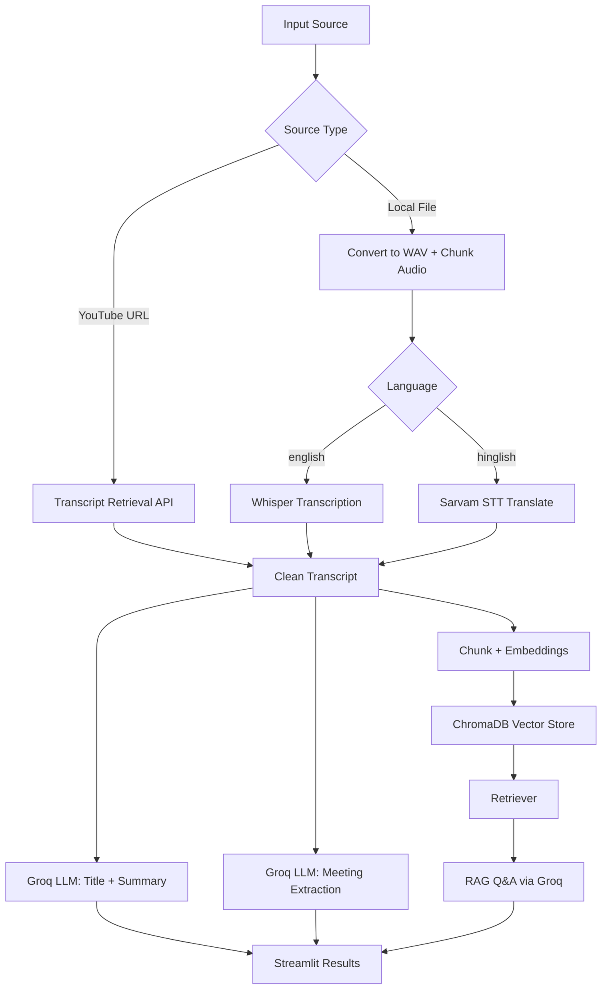

# 🎬 InsightMedia

<p align="center"><strong>AI Video & Meeting Intelligence</strong></p>
<p align="center"><em>Watch less. Understand more.</em></p>

<p align="center">
  
  
  
  
  
</p>

---

## 🚀 Project Overview
InsightMedia converts long-form video or meeting content into structured, searchable intelligence.

It supports two input paths:
- **YouTube URL** → Transcript retrieval API → Cleaned transcript
- **Local video/audio file** → Audio conversion + chunking → Whisper/Sarvam transcription

Then both paths flow into:
- **Groq-powered analysis** for title, summary, action items, key decisions, and open questions
- **ChromaDB vector store** for transcript chunk embeddings
- **RAG Q&A** so you can ask questions grounded in the processed transcript

---

## ✨ Key Features

| Feature | What it does |
|---|---|
| 🎥 Dual Input | Accepts YouTube URLs and local media files (`mp4`, `mkv`, `mov`, `avi`, `mp3`, `wav`, `m4a`) |
| 🧾 Transcript Pipeline | Builds transcript from URL or local audio/video pipeline |
| 🧠 AI Insights | Generates title, summary, action items, key decisions, open questions |
| 🔎 Content-Aware Extraction | Classifies meeting vs non-meeting before extracting meeting artifacts |
| 🗂️ Vector Search | Splits transcript, embeds it, and stores vectors in ChromaDB |
| 💬 RAG Chat | Answers user questions using only retrieved transcript context |
| 🎨 Streamlit UI | Multi-page app with Home, New Analysis, and RAG Chat views |

---

## 🏗️ Architecture



---

## 🧰 Tech Stack

- **Frontend/UI:** Streamlit
- **Language:** Python
- **LLM Layer:** Groq + LangChain (LCEL)
- **Transcription:** Whisper (local), Sarvam (for hinglish path), transcript API for YouTube URLs
- **Vector Store:** ChromaDB
- **Embeddings:** HuggingFace (`all-MiniLM-L6-v2`)
- **Media Processing:** pydub, ffmpeg
- **Utilities:** python-dotenv, requests, yt-dlp

---

## 📁 Project Structure

```text
Insight-Media/
├── app.py                     # Streamlit app
├── main.py                    # Pipeline orchestrator
├── requirements.txt
├── packages.txt
├── core/
│   ├── transcriber.py         # URL/local transcription paths
│   ├── summarizer.py          # Title + summary generation
│   ├── extractor.py           # Action items/decisions/questions extraction
│   ├── vector_store.py        # ChromaDB + embeddings setup
│   └── rag_engine.py          # RAG chain build + Q&A
├── utils/
│   └── audio_processor.py     # WAV conversion + chunking
├── test.py
└── old_app.py
```

---

## ⚙️ Installation & Setup

### 1) Clone and enter the project
```bash
git clone https://github.com/meghxx0602/Insight-Media.git
cd Insight-Media
```

### 2) Create and activate virtual environment
```bash
python -m venv .venv
source .venv/bin/activate  # Windows: .venv\Scripts\activate
```

### 3) Install dependencies
```bash
pip install -r requirements.txt
```

### 4) Configure environment variables
Create a `.env` file in the project root:

```env
GROQ_API_KEY=your_groq_api_key_here
YOUTUBETRANSCRIPT_API_KEY=your_transcript_api_key_here
SARVAM_API_KEY=your_sarvam_api_key_here
WHISPER_MODEL=small
SARVAM_STT_MODEL=saaras:v2.5
```

### 5) Ensure FFmpeg is available
This project uses `pydub`/audio conversion paths that require FFmpeg installed on your system.

---

## ▶️ Run the App

```bash
streamlit run app.py
```

Open the local Streamlit URL shown in your terminal.

---

## 💬 How RAG Q&A Works

1. Transcript is split into chunks.
2. Each chunk is converted into embeddings.
3. Embeddings are stored in a ChromaDB collection.
4. On each question, top relevant chunks are retrieved.
5. Groq answers using only retrieved transcript context (no outside knowledge expected by prompt rules).

---

## ⚠️ Current Limitations

- Depends on external APIs and valid keys for some transcription/LLM paths.
- RAG quality depends on transcript quality and retrieval relevance.
- Local transcription can be compute-intensive depending on media length and model choice.
- Collection naming is transcript-hash based; storage management is local and file-based.
- Input language options in UI are currently limited to `english` and `hinglish`.

---

## 🔭 Future Scope

- Better transcript/source management across multiple analyses.
- Improved retrieval controls (filters, top-k controls, citations per answer).
- Expanded language support and transcription routing options.
- Export/sharing workflows for summaries and meeting outputs.
- Automated tests for pipeline components and regression checks.

---

## 👩‍💻 Author

**Shabana**

Built with Streamlit, LangChain, Groq, Whisper/Sarvam, and ChromaDB.
